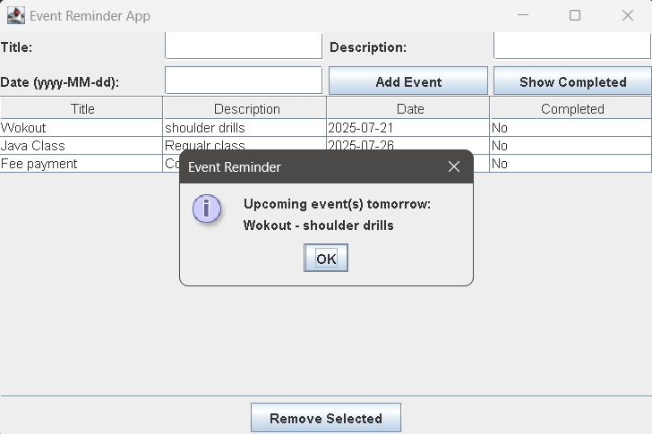
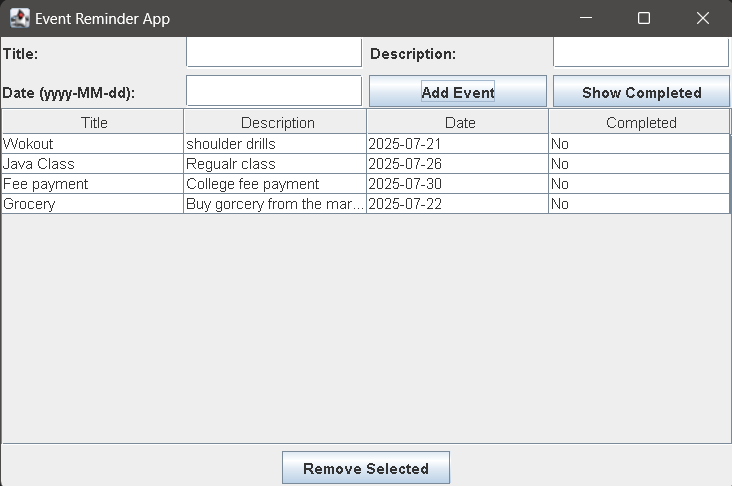

# Event Reminder Java Application
A simple Java Swing desktop application to manage and remind you of your events. Events are saved to a file for persistence, and the app will notify you if an event is scheduled for tomorrow.

  
  

## Features
- Add, view, and remove events with title, description, and date
- Mark events as completed (double-click in the table)
- View completed events
- Persistent storage: events are saved in `events.txt`
- Automatic popup reminder for events happening tomorrow (checks every minute)

## How to Run
1. **Requirements:**
   - Java 8 or higher
   - No external libraries required

2. **Compile:**
   - Open a terminal in the `Event_Reminder` directory
   - Run: javac *.java

3. **Run:**
   - Run the main class: java Event_Reminder.EventReminderApp

## Project Structure
- `EventReminderApp.java` — Main Swing GUI
- `ReminderManager.java` — Handles event storage and file operations
- `Event.java` — Event data model
- `events.txt` — Saved events (auto-created)

## License
This project is for educational use. Feel free to modify and use as you wish.
